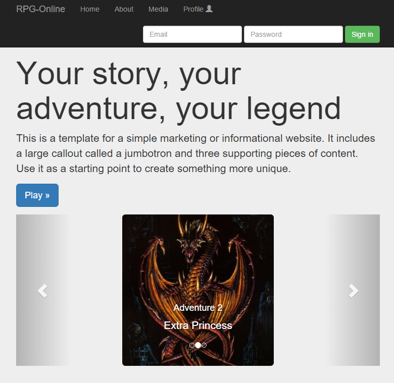

Site
=============

http://project-myrpgonline.herokuapp.com/

## Stack

* UI http://getbootstrap.com/
* CORE https://angularjs.org/

## Getting started

* Install (first time):
    * `npm install`
* Run:
    * `brunch watch --server`
* Test:
    * open your browser at [http://localhost:3333/](http://localhost:3333/)
* Learn:
    * go see Wiki
